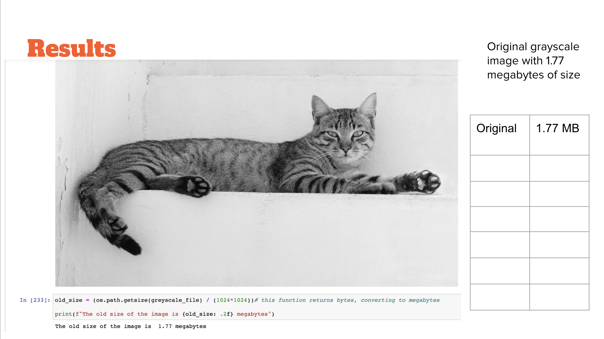
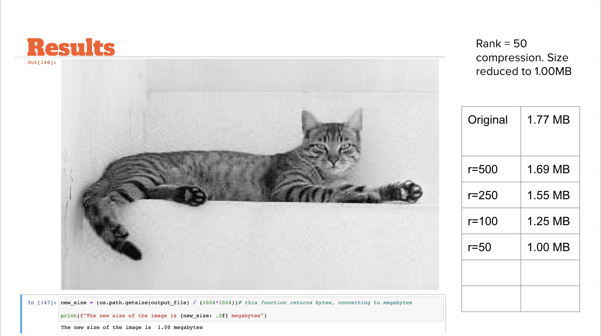
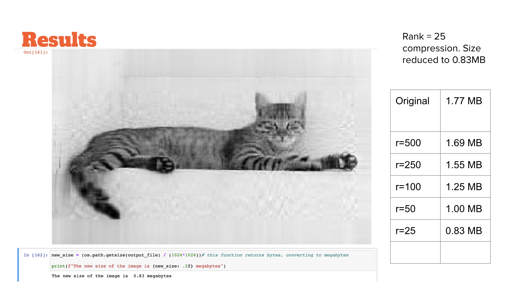
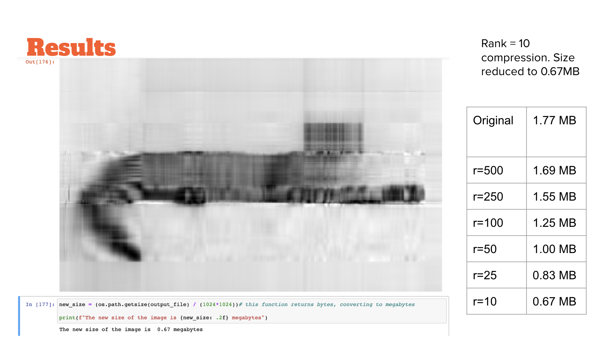

# Image Compression in Python

This is an image compression project coded in Python. For my linear algebra class in college, we were asked to research different applications of linear algebra in the real world. I was intrigued by how image compression uses linear algebra, more specifically singular value decomposition. I did research on the topic, and then decided to write a script in Python to see how it works.

For a quick glance at the project, take a look at the bottom of this file for images of the results.

## How does it work?

This project compresses greyscale images using singular value decomposition (SVD), a matrix factorization technique. I used PyTorch, OpenCV, and NumPy libraries in the process. Understanding the process or the code doesn't require any deep knowledge of image processing or linear algebra.

I started by loading an image in greyscale. In a greyscale image, each pixel has only one channel – intensity – with values ranging from 0 (black) to 255 (white). This simplifies the image into a 2D matrix of pixels, which is much easier to work with.

Next, I normalized the image by dividing every pixel value by 255. This changes the intensity range to [0, 1], which, many resources say, makes future calculations more accurate.

After normalization, I performed SVD on the image using PyTorch. This breaks the image into three matrices: U, S, and V. This is a way to express the original image data as a product of three matrices, and the image is now contained in these three matrices. To compress the image, I only kept a subset of the data in these matrices. Upon specifying a number of singular values (i.e., 'num_singular_values').

1. I kept only the first 'num_singular_values' columns of the U matrix.
2. I created a diagonal matrix with the first 'num_singular_values' singular values from the S matrix.
3. I kept the first 'num_singular_values' rows of the V matrix and then transposed it.

By keeping only a subset of the columns, rows, and singular values, I was effectively compressing the image. The important thing is that the most defining features are ranked in these matrices. So, the earlier columns of U and rows of V contain more important information than later ones.

I then reconstructed the compressed image by multiplying the compressed U, S, and V matrices together to get a single matrix again. Lastly, I denormalized the image by multiplying it by 255, converting it back to the greyscale intensity range [0, 255], and saved the compressed image as a new file.

I measured the file sizes of both the original and compressed images to show how effective the compression was. I am including images of the results below. This was an interesting project, showing how SVD can reduce the size of an image file by keeping only the most significant singular values. Many modern compression algorithms use similar techniques from linear algebra.

## Results

Rank, r, is the previously mentioned 'num_singular_values' (i.e., the number of vectors preserved). You can see how dropping num_singular_values also drops the image quality and size gradually.

